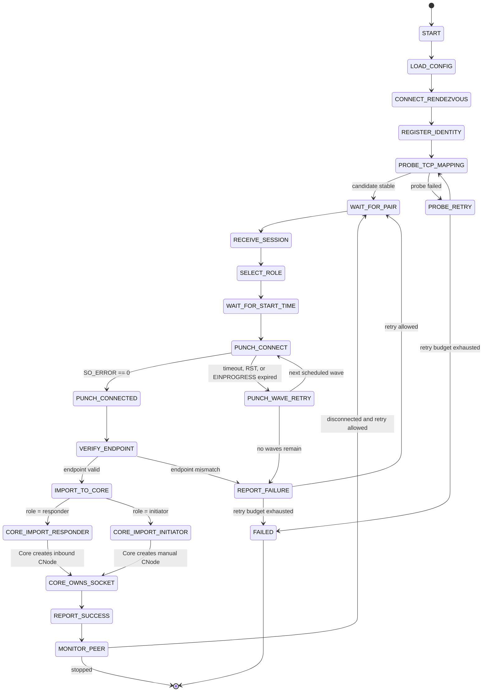

# Peer Socket Import for TCP Hole Punching

## Overview

This document specifies a Unix-only mechanism for allowing an external helper
process to create a direct TCP connection and hand the connected socket to
Bitcoin Core. The motivating use case is TCP simultaneous-open NAT traversal
for nodes behind NATs where PCP and NAT-PMP do not create an inbound mapping.

The design deliberately keeps NAT traversal outside Bitcoin Core. A standalone
sidecar performs rendezvous, endpoint discovery, TCP simultaneous open, and
retry scheduling. Bitcoin Core only learns how to receive an already-connected
TCP socket over a local Unix domain socket and add it to the normal P2P
connection manager.

No Bitcoin P2P protocol changes are required. The first bytes on the imported
TCP stream are Bitcoin P2P transport bytes generated by Bitcoin Core.

## Goals

- Allow two cooperating NATed nodes to establish a direct TCP connection.
- Avoid relaying or proxying Bitcoin P2P bytes through the sidecar after setup.
- Keep the Bitcoin Core change small and limited to Unix platforms.
- Reuse existing `CConnman` peer lifecycle, eviction, permissions, and message
  handling logic.
- Keep sidecar authentication and rendezvous traffic off the Bitcoin P2P TCP
  stream.

## Non-Goals

- No support for Windows in the initial implementation.
- No support for arbitrary unmodified remote Bitcoin peers.
- No public relay fallback in the initial implementation.
- No Bitcoin P2P message changes.
- No NAT traversal logic inside Bitcoin Core.
- No BIP324/v2 transport support in the first implementation.

## Architecture

There are three components:

- `bitcoind`: runs normal Bitcoin P2P logic and imports connected TCP sockets
  from a local Unix domain socket.
- `btcpunchd`: a local sidecar that performs NAT traversal and passes
  successful connected TCP sockets to `bitcoind`.
- `rendezvousd`: a public coordination service used by sidecars to exchange
  public TCP candidates and synchronize simultaneous-open attempts.

The data path after setup is:

```text
bitcoind A == direct punched TCP socket == bitcoind B
```

The sidecars are not in the post-setup data path. They only create and transfer
the kernel socket.

## Bitcoin Core Import Socket

### Configuration

Add a Unix-only option:

```text
-importpeersocket=<path>
```

When set, Bitcoin Core creates a Unix domain listening socket at `<path>`.
Relative paths are resolved under the network datadir. The option is rejected
on non-Unix platforms.

The option should initially be hidden or marked experimental. It exposes a
local capability to add P2P peers, so deployments should place the socket in a
directory only writable by the node operator.

### Import Message

The sidecar connects to `-importpeersocket` and sends one metadata message plus
exactly one file descriptor using `SCM_RIGHTS`.

The metadata format is fixed size and little-endian:

```c
struct ImportPeerSocketV1 {
    uint32_t magic;      // ASCII "BIPS", encoded as 0x53504942.
    uint16_t version;    // 1.
    uint8_t role;        // 0 = responder, 1 = initiator.
    uint8_t transport;   // 0 = v1 transport only.
    uint32_t flags;      // Must be 0.
};
```

The import request is rejected if:

- the metadata length is not exactly `sizeof(ImportPeerSocketV1)`;
- `magic` is not `"BIPS"`;
- `version` is not `1`;
- `role` is not one of the defined values;
- `transport` is not `0`;
- `flags` is nonzero;
- the ancillary data does not contain exactly one fd;
- the received fd is not a connected TCP socket.

### Roles

TCP simultaneous open is a socket-level connection technique. Bitcoin P2P still
needs exactly one side to behave as the application-level initiator.

The sidecar coordination layer must assign one peer each role:

- responder: imported into Bitcoin Core as an inbound peer;
- initiator: imported into Bitcoin Core as a manual outbound peer.

This avoids a deadlock where both Bitcoin Core peers wait for the remote
`version` message. It also creates a clean path for future BIP324 support,
where exactly one side must be the BIP324 initiator.

For the first implementation, imported sockets always use v1 transport.

### Socket Validation

Bitcoin Core must derive peer and local addresses from the received fd:

- peer address: `getpeername(fd)`;
- local bind address: `getsockname(fd)`.

The sidecar does not provide peer addresses to Bitcoin Core.

Bitcoin Core validates and prepares the fd before adding it as a peer:

- socket family is `AF_INET` or `AF_INET6`;
- socket type is `SOCK_STREAM`;
- `SO_ERROR == 0`;
- `getpeername()` and `getsockname()` succeed;
- both addresses can be represented as `CService`;
- socket is selectable;
- socket is set nonblocking;
- `TCP_NODELAY` is set;
- `SO_NOSIGPIPE` is set where available.

If validation fails, Bitcoin Core closes the fd and logs a debug or info
message. Validation failure must not disconnect existing peers.

### Peer Creation

The existing inbound path already centralizes most of the desired behavior in
`CConnman::CreateNodeFromAcceptedSocket()`. The implementation should reuse
that behavior rather than adding a parallel P2P lifecycle.

The current inbound path should remain unchanged:

```text
listen socket -> accept() -> CreateNodeFromAcceptedSocket()
```

The import path should be:

```text
Unix import socket -> recvmsg(SCM_RIGHTS) -> validate fd -> create CNode
```

Refactor as narrowly as possible:

- keep the current accepted-socket helper for real inbound accepts;
- add a shared helper that creates a `CNode` from an already-connected `Sock`;
- support `ConnectionType::INBOUND` and `ConnectionType::MANUAL`;
- pass `use_v2transport=false` for imported MVP sockets.

Responder imports use the same inbound limit, ban, discouragement, eviction,
permission, and initialization behavior as normal inbound peers.

Initiator imports should behave like manual outbound peers for handshake
purposes, but they are not added to `-addnode` state and Bitcoin Core does not
attempt automatic reconnects if they disconnect. The sidecar owns retries.

### Limits

The import socket is a local capability and should be rate limited.

Minimum acceptable behavior:

- imported responders count against inbound slots;
- imported initiators count against manual connection limits or a new small
  import-initiator limit;
- failed imports are cheap and do not allocate a `CNode`.

Open design choice:

- reuse `semAddnode` for imported initiators;
- or introduce an explicit `-maximportedpeerconnections` limit.

The minimal first patch should reuse existing limits if possible.

### Credentials

When the platform supports local peer credential inspection, Bitcoin Core should
verify that the process connecting to the import socket has the same effective
uid as Bitcoin Core:

- Linux: `SO_PEERCRED`;
- BSD/macOS: `getpeereid()`.

If a platform lacks a credential API but supports `SCM_RIGHTS`, the import
socket path permissions are the enforcement mechanism. This should be logged at
startup.

### Shutdown

On shutdown, Bitcoin Core:

- interrupts the import thread;
- closes the Unix listening socket;
- joins the import thread;
- unlinks the socket path it created;
- leaves already-imported P2P sockets to the normal peer shutdown path.

## Sidecar Specification

### Configuration

Example `btcpunchd` configuration:

```toml
network = "main"
core_import_socket = "/home/user/.bitcoin/import-peer.sock"
rendezvous = "rendezvous.fish.foo:443"
stun_tcp = "stun.fish.foo:3478"
identity_key = "/home/user/.btcpunchd/identity.key"
punch_port = 8333
connect_timeout_ms = 5000
```

The sidecar may use a port other than 8333 if Bitcoin Core already owns that
local port. The rendezvous candidate must reflect the actual local port used to
create the NAT mapping.

### Identity

Each sidecar has a long-term Ed25519 identity key.

The identity is used only for rendezvous and coordination. It is not written to
the punched TCP stream. Bitcoin Core continues to treat the remote peer as an
unauthenticated Bitcoin P2P peer.

### Rendezvous Control Channel

The sidecar maintains an authenticated encrypted control channel to
`rendezvousd`. TLS with client certificates or a Noise-based protocol are both
reasonable. The initial implementation should choose one and avoid supporting
multiple authentication mechanisms.

Registration includes:

- sidecar identity public key;
- Bitcoin network name;
- observed public TCP candidate;
- NAT probe result;
- supported Bitcoin transport modes, initially `v1`;
- software version;
- optional operator-configured peer allowlist.

### TCP Candidate Discovery

The sidecar discovers its public TCP candidate by binding a local TCP socket to
the configured punch port and connecting to a public TCP probe endpoint.

The public probe endpoint can be:

- STUN over TCP on `stun.fish.foo:3478`; or
- a simple rendezvous TCP endpoint that reports the observed source address and
  port.

The sidecar should run at least two probes against different public
destination ports when available. This helps distinguish stable endpoint-
independent mappings from connection-dependent mappings.

Candidate fields:

```text
local address family
local punch port
observed public ip
observed public port
probe destination
mapping stability estimate
timestamp
```

### Punch Session

When two sidecars are paired, `rendezvousd` assigns a punch session:

```text
session_id
peer public TCP candidate
local role: initiator or responder
start time
retry schedule
transport: v1
expiration time
```

The assigned roles are Bitcoin P2P roles, not TCP roles. Both sidecars perform
TCP simultaneous open.

### TCP Simultaneous Open

At the scheduled start time, both sidecars:

1. create a TCP socket;
2. set `SO_REUSEADDR`;
3. set `SO_REUSEPORT` where available and useful;
4. bind to the selected local punch port;
5. set nonblocking mode;
6. call `connect()` to the remote public candidate;
7. poll for write readiness;
8. verify `SO_ERROR == 0`;
9. verify the connected peer endpoint where the OS exposes it.

The sidecar must treat these as distinct outcomes:

- success;
- local bind failure;
- immediate connect failure;
- connect timeout;
- connection reset;
- unexpected connected endpoint;
- local NAT mapping changed;
- Core fd import failed.

### Retry Schedule

The initial retry schedule should use a few synchronized waves:

```text
wave 1: T + 0 ms
wave 2: T + 750 ms
wave 3: T + 2000 ms
wave 4: T + 5000 ms
```

Each wave should reuse the same local punch port when possible. If the port
cannot be reused due to local TCP state, the sidecar should report this as a
diagnostic rather than silently switching ports.

### File Descriptor Handoff

After a successful TCP connection:

1. The sidecar sends no bytes on the TCP stream.
2. The sidecar opens `core_import_socket`.
3. The sidecar sends `ImportPeerSocketV1` plus the connected TCP fd using
   `SCM_RIGHTS`.
4. The sidecar waits for the Unix socket to close or for a small acknowledgement
   if one is added later.
5. The sidecar closes its duplicate fd.
6. The sidecar reports success to `rendezvousd`.

The punched TCP stream must be pristine. Sidecar authentication tokens,
signatures, and session markers stay on the rendezvous control channel.

### Rendezvous Server Responsibilities

`rendezvousd`:

- authenticates sidecars;
- tracks current candidates and liveness;
- pairs compatible sidecars;
- assigns exactly one initiator and one responder per session;
- distributes synchronized start times and retry schedules;
- records success/failure diagnostics;
- does not relay Bitcoin P2P traffic.

The rendezvous server should prefer pairings with stable endpoint mappings and
compatible address families.

## Connection State Machine

The connection state machine is maintained by the sidecar. Bitcoin Core only
enters the flow at `IMPORT_TO_CORE`.

The diagram is kept in
`doc/design/peer-socket-import-state-machine.mmd`.



## Implementation Plan

### Commit 1: Unix fd receive helper

- Add a narrow Unix-only helper to receive exactly one fd plus a fixed-size
  metadata buffer from a Unix domain socket.
- Add tests using `socketpair(AF_UNIX, SOCK_STREAM, 0, ...)`.
- Keep this helper independent of P2P logic.

### Commit 2: Import socket option and listener

- Add `-importpeersocket=<path>` option.
- Add `CConnman::Options::m_import_peer_socket_path`.
- Bind and listen on the Unix socket during `CConnman::Start()`.
- Add an import thread that accepts local clients and reads import requests.
- Add shutdown cleanup and unlinking.

### Commit 3: Imported peer creation

- Refactor the current accepted-socket path to share validation and `CNode`
  creation.
- Add imported responder support as `ConnectionType::INBOUND`.
- Add imported initiator support as `ConnectionType::MANUAL`.
- Force `use_v2transport=false`.
- Ensure imported initiators send `version` promptly.

### Commit 4: Functional tests

- Add a functional test that creates a connected TCP socket pair through normal
  local sockets, sends one fd to Core, and verifies a peer appears.
- Test responder import.
- Test initiator import and verify Core sends `version`.
- Test rejection cases: missing fd, invalid metadata, wrong socket type.

### Commit 5: Sidecar MVP

- Implement `btcpunchd` in Rust.
- Add config parsing, identity key loading, rendezvous connection, TCP mapping
  probe, synchronized punch loop, and Core fd handoff.
- Log structured diagnostics for all punch outcomes.
- Keep Bitcoin TCP stream untouched before fd handoff.

### Commit 6: Rendezvous MVP

- Implement `rendezvousd`.
- Authenticate sidecars.
- Track candidates.
- Pair sidecars.
- Assign roles and retry schedules.
- Record success/failure reports.

### Commit 7: Diagnostics and hardening

- Add NAT behavior classification output.
- Add metrics for punch success/failure by failure class.
- Add candidate expiration.
- Add operator allowlists.
- Add more exact credential validation where platforms support it.

## Open Questions

- Should imported initiators reuse `semAddnode`, or should imports have their
  own explicit connection limit?
- Should `-importpeersocket` be hidden, debug-only, or documented as
  experimental?
- Should Core send an acknowledgement over the Unix import connection after
  successful import, or is close-on-success enough for the MVP?
- Should the sidecar choose a punch port different from the Bitcoin listen port
  by default to avoid local bind conflicts?
- What is the minimum acceptable platform set beyond Linux, for example
  FreeBSD and macOS?
